# Burj Khalifa Work Breakdown Structure

## Simplified Overview of Project

```mermaid
    graph TD;
id45(Burj Khalifa Construction)-->id1(Plan and Design)
id45(Burj Khalifa Construction)-->id4(Pour Concrete Floors)
id45(Burj Khalifa Construction)-->id5(Install Cladding)
id45(Burj Khalifa Construction)-->id6(Install Building Systems)
id45(Burj Khalifa Construction)-->id7(Complete Interior Fit-Out)
id45(Burj Khalifa Construction)-->id8(Final Inspection and Handover)
id1(Plan and Design)-->id2(Build Foundation);
id2(Build Foundation)-->id9(Site Preparation);
id9(Site Preparation)-->id10(Clear Site);
id9(Site Preparation)-->id11(Excavate Foundation);
id9(Site Preparation)-->id12(Install Utilities);
id2(Build Foundation)-->id13(Pile Installation);
id13(Pile Installation)-->id14(Drill Holes for Piles);
id13(Pile Installation)-->id15(Insert Steel Reinforcement);
id13(Pile Installation)-->id16(Pour Concrete);
id2(Build Foundation)-->id17(Build Raft);
id17(Build Raft)-->id18(Install Formwork);
id17(Build Raft)-->id19(Pour Concrete);
id2(Build Foundation)-->id20(Build Diaphragm Walls);
id20(Build Diaphragm Walls)-->id21(Excavate Trench);
id20(Build Diaphragm Walls)-->id22(Install Formwork);
id20(Build Diaphragm Walls)-->id23(Pour Concrete);
id2(Build Foundation)-->id3(Erect Steel Frame);
id3(Erect Steel Frame)-->id24(Fabricate Steel Sections);
id3(Erect Steel Frame)-->id25(Transport Steel Sections to Site);
id3(Erect Steel Frame)-->id26(Install Steel Beams and Columns);
id4(Pour Concrete Floors)-->id27(Fabricate Reinforcement Bars);
id4(Pour Concrete Floors)-->id28(Install Formwork);
id4(Pour Concrete Floors)-->id29(Pour Concrete);
id4(Pour Concrete Floors)-->id30(Install MEP Systems);
id5(Install Cladding)-->id31(Fabricate Cladding Panels);
id5(Install Cladding)-->id32(Transport Cladding Panels to Site);
id5(Install Cladding)-->id33(Install Cladding Panels);
id6(Install Building Systems)-->id34(Install MEP Systems);
id6(Install Building Systems)-->id35(Install Elevators);
id6(Install Building Systems)-->id36(Install Plumbing);
id6(Install Building Systems)-->id37(Install Electrical Systems);
id7(Complete Interior Fit-Out)-->id38(Install Interior Walls);
id7(Complete Interior Fit-Out)-->id39(Install Flooring);
id7(Complete Interior Fit-Out)-->id40(Install Fixtures and Fittings);
id7(Complete Interior Fit-Out)-->id41(Paint and Decorate);
id8(Final Inspection and Handover)-->id42(Conduct Final Inspection);
id8(Final Inspection and Handover)-->id43(Obtain Occupancy Permit);
id8(Final Inspection and Handover)-->id44(Hand Over Building);
```


## Detailed WBS of Project Initiation
```mermaid
    graph TD;
id1(Project Initiation)--> id2(Establish Project Objectives);
id1(Project Initiation)--> id3(Define Project Scope);
id1(Project Initiation)--> id4(Identify Stakeholders);
id1(Project Initiation)--> id5(Conduct Feasibility Studies);
id1(Project Initiation)--> id6(Obtain Approvals);
id1(Project Initiation)--> id7(Secure Project Funding);

id5(Conduct Feasibility Studies)-->id8(Analyse Site);
id5(Conduct Feasibility Studies)-->id9(Identify Potential Risks);

id3(Define Project Scope)-->id10(Determine Requirements);
id3(Define Project Scope)-->id11(Define Deliverables);
id3(Define Project Scope)-->id12(Define Objectives);

id10(Determine Requirements)-->id13(Identify Building Codes);
id10(Determine Requirements)-->id14(Identify Environmental Standards);
id10(Determine Requirements)-->id15(Identify Permit Requirements);

id11(Define Deliverables)-->id16(Develop Conceptual Design);
id11(Define Deliverables)-->id17(Prepare Schematic Design);
id11(Define Deliverables)-->id18(Develop Detailed Design);

id16(Develop Conceptual Design)-->id19(Conduct Site Analysis);
id16(Develop Conceptual Design)-->id20(Develop Project Requirements);

id17(Prepare Schematic Design)-->id21(Review and Approve Design);
id17(Prepare Schematic Design)-->id22(Develop Construction Drawings);

id18(Develop Detailed Design)-->id23(Develop Technical Specifications);

id6(Obtain Approvals)-->id24(Identify Required Approvals);
id6(Obtain Approvals)-->id25(Prepare Approval Applications);
id6(Obtain Approvals)-->id26(Submit Approval Applications);

id7(Secure Project Funding)-->id27(Identify Required Funding);
id7(Secure Project Funding)-->id28(Develop Funding Plan);
id7(Secure Project Funding)-->id29(Solicit Funding);

id27(Identify Required Funding)-->id30(Estimate Project Costs);
id27(Identify Required Funding)-->id31(Identify Potential Funding Sources);
id27(Identify Required Funding)-->id32(Determine Funding Requirements);

id29(Solicit Funding)-->id33(Present Project Proposal);
id29(Solicit Funding)-->id34(Negotiate Funding Terms);

id33(Present Project Proposal)-->id35(Obtain Funding);

id24(Identify Required Approvals)-->id36(Identify Regulatory Bodies);
id24(Identify Required Approvals)-->id37(Identify Approval Requirements);

id26(Submit Approval Applications)-->id38(Obtain Required Approvals);

id13(Identify Building Codes)-->id39(Review Building Codes);

id14(Identify Environmental Standards)-->id40(Review Environmental Standards);

id15(Identify Permit Requirements)-->id41(Identify Permitting Agencies);
id15(Identify Permit Requirements)-->id42(Identify Permitting Requirements);

id19(Conduct Site Analysis)-->id43(Conduct Topographical Surveys);
